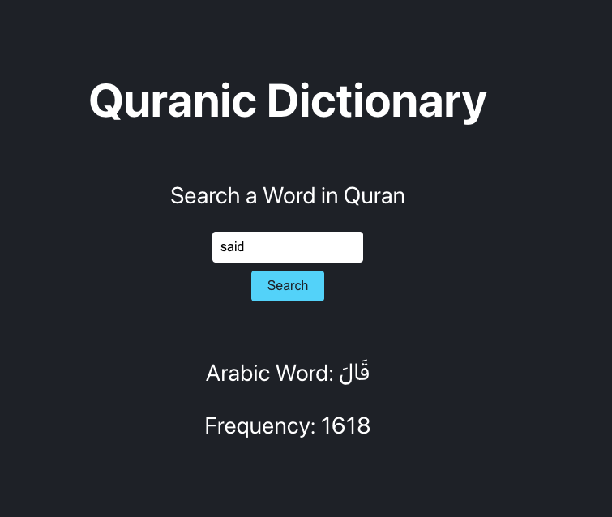

# Arabic Dictionary

A package to search for Arabic words by their English meanings.

## Installation

You can install the package using npm:

```bash
npm install arabic-dictionary

Usage
To use the arabic-dictionary package, first require it and then create an instance of the ArabicDictionary class. You can then use the search method to find the Arabic word and its frequency by providing an English word.

Example
javascript
Copy code
const ArabicDictionary = require('arabic-dictionary');

const dictionary = new ArabicDictionary();
const result = dictionary.search('God');

if (result) {
  console.log(`Arabic Word: ${result.ArabicWord}`);
  console.log(`Frequency: ${result.Frequency}`);
} else {
  console.log('No result found');
}

API
search(word)
Search for an Arabic word by its English meaning.

word (string): The English word to search for.
Returns an object with the following properties if the word is found:
ArabicWord (string): The Arabic word.
Frequency (number): The frequency of the Arabic word in the dataset.
Returns null if the word is not found.
Data
The data used by this package is stored in a JSON file (data.json) and contains Arabic words, their frequencies, and English translations.


Author
Mizanur Rahman Nickty


```
